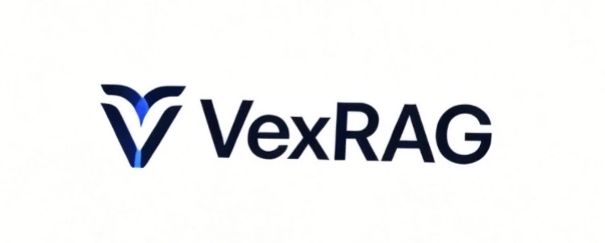

<p align="center">
  
</p>

<p align="center">
  <a href="https://github.com/Shepard2154/VexRAG"></a>
  <a href="https://pepy.tech/projects/vexrag"></a>
</p>

Most RAG security tools focus on jailbreaking or prompt injection. VexRAG is different: it injects poisoned passages directly into the retrieval index and measures whether the system’s answers remain factually correct. It is not about safety refusals — it’s about functional correctness under adversarial data manipulation.

> **Stability notice (pre-0.2.0):** VexRAG is currently test-stage software and is **not production-ready**.
> Until version `0.2.0`, backward compatibility is **not guaranteed** and updates may include **breaking changes**.

**Sample RAG stacks** for getting started: [RAG examples](RAG%20examples/README.md).

## Quickstart

### Prerequisites

```bash
python --version  # requires 3.11+
ollama list
```

Install/pull required Ollama models:

```bash
ollama pull llama3:8b
ollama pull nomic-embed-text:latest
```

You also need a running target API endpoint (for the small example: `http://localhost:8080`).

### 1) Install VexRAG

```bash
pip install vexrag
```

For vector DB-specific extras:

```bash
pip install "vexrag[qdrant]"
pip install "vexrag[chroma]"
pip install "vexrag[faiss]"
```

### 2) Verify installation

```bash
vx --help
```

### 3) Run a scan from config

```bash
vx scan --config path/to/scan.yml
```

Use sample configs from `RAG examples/` as a starting point.

### 4) First successful scan (small local example)

From `RAG examples/small/rag_01_in_memory_en`:

```bash
python3 -m venv .venv
source .venv/bin/activate
pip install -r requirements.txt
python small_rag.py
vx scan --config scan_configs_examples/vexrag-chain-hijack-then-poisoned-semantic-ollama-nomic.yaml
```

Expected outcome:
- `small_rag.py` serves the target API on `http://localhost:8080`.
- `vx scan` completes and prints a scan report with attack/evaluation results (no connection/preflight errors).

## Project roadmap

### Done
- [x] Implementation of PoisonedRAG (**arXiv:** [2402.07867](https://arxiv.org/abs/2402.07867))
- [x] Implementation of HijackRAG (**arXiv:** [2410.22832](https://arxiv.org/abs/2410.22832))
- [x] Automatic generation of attack cases for both methods
- [x] Support for vLLM and Ollama
- [x] Simple RAG examples for quick onboarding to VexRAG
- [x] Support for Qdrant, FAISS, Chroma, and file-based retrieval backends

### In Progress
- [ ] Codebase hardening: refactors, typing, tooling, *removing AI slop*

### Ideas / Backlog
- [ ] Expand red-team methods in VexRAG
- [ ] Expand supported retrieval backends
- [ ] Implement a web version of VexRAG

